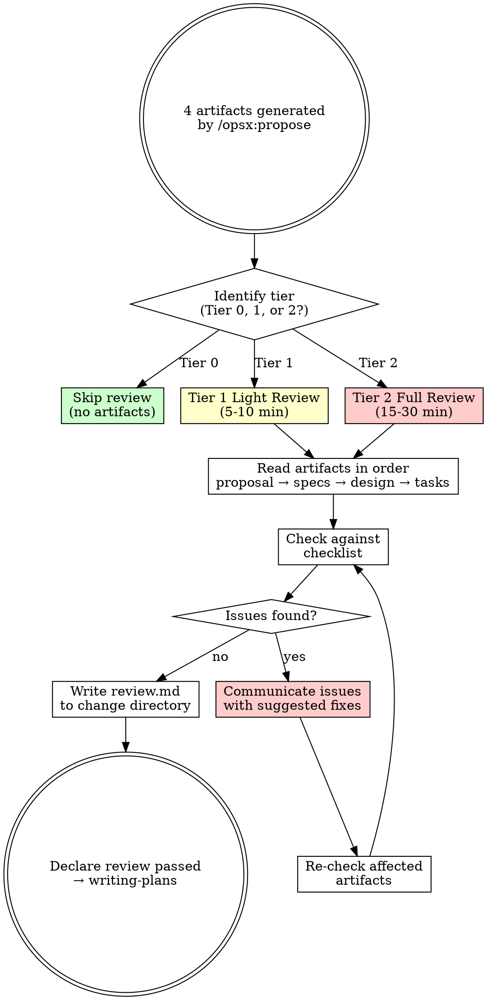

<SUBAGENT-STOP>
If you were dispatched as a subagent to execute a specific task, skip this skill.
</SUBAGENT-STOP>

## Instruction Priority

1. **User's explicit instructions** (CLAUDE.md, AGENTS.md, direct requests) — highest priority
2. **OpenSpec artifacts** (proposal.md, specs/, design.md, tasks.md) — the authoritative spec baseline
3. **This skill's review process** — validate artifacts before code
4. **Default system prompt** — lowest priority

If the user says "skip the review, just write code," follow the user's instructions. The user is in control.

# SDD Review Specs

## Overview

AI-generated specs are initial drafts, not final contracts. They reflect what the AI understood — not necessarily what you intended. Reviewing specs is the most critical human judgment gate in spec-driven development.

**Core principle:** Every AI-generated spec artifact must be reviewed by a human before any code is written.

**Announce at start:** "I'm using the sdd-review-specs skill to review the OpenSpec artifacts."

**Violating the letter of this review process is violating the spirit of spec-driven development.**

## The Iron Law

```
NO CODE WITHOUT REVIEWED SPECIFICATIONS
```

If the 4 artifacts haven't been reviewed, you cannot proceed to implementation.

## When to Review

**ALWAYS review after `/opsx:propose` generates artifacts.** Never skip review because:
- AI misinterprets scope boundaries
- AI generates "happy path" specs with insufficient error coverage
- AI makes technology choices incompatible with existing architecture
- AI omits edge cases that a human would catch immediately

**Review is NOT required for:**
- Tier 0 changes: one-line fixes, typos, log lines, comments (no artifacts to review)

## Tier-Based Review Depth

Not every change needs the same review depth. Classify by scope:

| Tier | Applies To | Review Scope | Time |
|------|-----------|-------------|------|
| **Tier 0 — Skip** | Typo fixes, log lines, comments, one-line changes | No artifacts exist. Verify with build/lint directly. | 0 min |
| **Tier 1 — Light** | Single-field additions, simple validation changes, config tweaks | Review `proposal.md` scope + `tasks.md` executability. Skim `design.md`. | 5-10 min |
| **Tier 2 — Full** | New features, cross-package refactors, architecture changes, API additions | Full review of all 4 artifacts with complete checklist. | 15-30 min |

**If unsure, default to Tier 2.** Over-reviewing is cheaper than missing a critical issue.

## The Gate Function



```
BEFORE proceeding to any implementation:

1. IDENTIFY tier — Tier 0, 1, or 2?
2. READ each artifact in order: proposal → specs/ → design → tasks
3. CHECK against the checklist for your tier (below)
4. FEEDBACK — communicate every issue found, with suggested fix
5. ITERATE — after AI fixes, re-check affected artifacts
6. ONLY THEN — declare review passed
7. PRODUCE review evidence — write review result to openspec/changes/<name>/review.md
   (minimum: tier chosen, checklist results, issues found/resolved, pass/fail declaration)
8. ROUTE — to superpowers:writing-plans
```

## Tier 2 Full Review Checklist

Create a task for each artifact. Complete in order.

### 1. proposal.md — Scope & Motivation

- [ ] **Motivation clear:** Can a new team member understand WHY this change exists by reading the first 3 sentences?
- [ ] **Scope explicit:** Is every in-scope item concretely named (not "and related features")?
- [ ] **Out of scope explicit:** Are excluded items listed with reasons ("deferred to future change" vs "not applicable")?
- [ ] **No scope creep signals:** No phrases like "and similar improvements" or "as needed"
- [ ] **Boundary contract:** If someone later asks "can we add X to this change?", can you answer by pointing to in/out scope?

### 2. specs/ — Behavioral Completeness

- [ ] **Happy paths covered:** Every in-scope item in proposal.md maps to ≥1 behavioral requirement in specs/
- [ ] **Error paths covered:** For every happy path, are there corresponding error/edge case requirements?
- [ ] **Input validation:** Are invalid inputs, boundary values, and null/empty states addressed?
- [ ] **State transitions:** If the feature involves state changes, are all transitions defined?
- [ ] **No vague language:** No "should handle errors appropriately" without specifying HOW
- [ ] **Interface signatures:** If the spec defines functions/APIs, are signatures concrete (types, parameters, return values)?
- [ ] **Consistency with proposal.md:** Does every spec requirement fall within proposal.md's scope?

### 3. design.md — Technical Soundness

- [ ] **Approach justified:** Does it explain WHY this approach over alternatives?
- [ ] **Alternatives documented:** Are rejected alternatives listed with rejection reasons?
- [ ] **Dependency check:** Do new dependencies conflict with existing ones?
- [ ] **Existing patterns respected:** Does the design follow established project conventions?
- [ ] **Integration points:** Are touch points with existing modules explicitly named?
- [ ] **Risks identified:** Are there risk items and mitigation strategies?
- [ ] **Concurrency/performance:** If relevant, are goroutine/thread safety, memory, and latency considered?

### 4. tasks.md — Executability

- [ ] **Complete coverage:** Does every in-scope item from proposal.md map to ≥1 checkbox?
- [ ] **Test tasks included:** Does every implementation task have a corresponding test task?
- [ ] **No vague tasks:** No "handle edge cases" or "add appropriate error handling" — each task is concrete
- [ ] **Correct ordering:** Do dependent tasks come after their dependencies?
- [ ] **Independently executable:** Can a developer (or AI) pick up any single task and complete it without reading others?
- [ ] **Verifiable per task:** Is there a clear "done" signal for each checkbox (test passes, file exists, etc.)?

## Tier 1 Light Review Checklist

- [ ] **proposal.md:** Scope boundaries clear? In/out scope reasonable?
- [ ] **tasks.md:** Each task concrete and executable? Test tasks paired with implementation tasks?
- [ ] **design.md (skim):** Any obviously wrong technology choices? Any conflict with existing dependencies?
- [ ] **specs/ (skim):** Any obvious missing error paths?

## Red Flags — STOP and Revise

These patterns in AI-generated artifacts mean the spec is NOT ready:

### proposal.md Red Flags
- "and related features" / "as needed" / "etc." — scope creep by design
- In-scope list has 10+ items — change is too large, split it
- No out-of-scope section — AI avoided saying "no"

### specs/ Red Flags
- All happy paths, zero error paths — AI only described the ideal case
- "should work correctly" / "should handle errors" — too vague to verify
- No edge cases (empty input, null, boundary values, concurrency) — incomplete
- Requirements that can't be tested — "the system should be fast"

### design.md Red Flags
- "Use [technology]" without explaining WHY — missing decision record
- No alternatives section — AI didn't consider other approaches
- "Similar to [existing module]" without specifics — lazy design
- Introduces a new dependency without noting it — architectural drift
- Ignores existing project conventions — AI didn't read project.md/CLAUDE.md

### tasks.md Red Flags
- Tasks with "and" in the name — should be split
- No test tasks — TDD impossible without them
- "Refactor as needed" / "Add error handling" — placeholder tasks
- Tasks ordered alphabetically rather than by dependency — wrong order

**Any of these red flags means: the artifact is not ready. Give specific feedback and request revision.**

## Common Rationalizations

| Excuse | Reality |
|--------|---------|
| "The AI usually gets this right" | AI makes systematic mistakes. Review catches them. |
| "I'll catch issues during implementation" | Finding issues during coding costs 10x more to fix. |
| "The spec looks reasonable at a glance" | Skimming is not reviewing. Use the checklist. |
| "This is too small to need review" | Small changes have the most unexamined assumptions. |
| "I trust the AI's design decisions" | Trust but verify. The AI doesn't know your unwritten conventions. |
| "Review takes too long" | Rework from unreviewed specs takes longer. |
| "I already reviewed it during brainstorming" | Brainstorming explores. Propose formalizes. They're different artifacts. |
| "The tests will catch spec issues" | Tests verify implementation, not design quality. Wrong design + passing tests = wrong product. |
| "A targeted partial review is honest pragmatism" | Partial review is partial compliance. The tier exists for a reason — if it's Tier 2 by classification, Tier 1 review is insufficient. |
| "Full review when tired is performative" | Fatigue degrades thoroughness, but skipping review entirely guarantees zero thoroughness. Defer the review — don't rationalize a skim. |

**All of these mean: do the review. Follow the checklist.**

## Skill Types

**sdd-review-specs is a RIGID skill.** The gate function is non-negotiable for Tier 2. Follow the checklist exactly. Don't adapt away the sequence.

Within the review process:
- **Tier classification** — Use judgment. When unsure, default to Tier 2.
- **Checklist execution** — Rigid. Every item must be checked.
- **Issue communication** — Flexible. Adapt feedback style to the context.

## Common Failures

| Claim | Requires | Not Sufficient |
|-------|----------|----------------|
| "Specs reviewed" | Every checklist item checked, issues documented, review.md written to change directory | "Read through it", "looks fine" |
| "Scope is clear" | In/out scope sections are explicit and complete | "I know what they mean" |
| "Design is solid" | Alternatives documented, decisions justified, risks noted | "The approach makes sense" |
| "Tasks are executable" | Each task concrete, independently verifiable, correctly ordered | "The list looks complete" |
| "Ready for implementation" | All red flags resolved, tier-appropriate checklist passed, review.md present | "Should be good enough" |
| "Review done — I checked tasks.md boxes" | sdd-review-specs gate function invoked with tier classification and checklist results | Checking off implementation tasks in tasks.md is progress tracking, not spec review |

## After Review Passes

```
Review passed → invoke superpowers:writing-plans to refine task granularity.
                Save the implementation plan to openspec/changes/<name>/plan.md.
```

**REQUIRED SUB-SKILL:** Use superpowers:writing-plans to convert the reviewed tasks.md into 2-5 minute bite-sized tasks. Save output to `openspec/changes/<name>/plan.md` — all artifacts for this change live in one directory. The reviewed artifacts are now the authoritative spec baseline — writing-plans works from them.

## User Instructions

Review is the human judgment gate, not a blocker. AI generates fast. Humans decide correctly. If you want to skip review or downgrade from Tier 2 to Tier 1, say so explicitly. The skill provides the framework, you provide the judgment.

## The Bottom Line

**No code before reviewed specs.**

Read each artifact. Check against the checklist. Flag every issue. Only when all artifacts pass review does implementation begin.

This is non-negotiable.