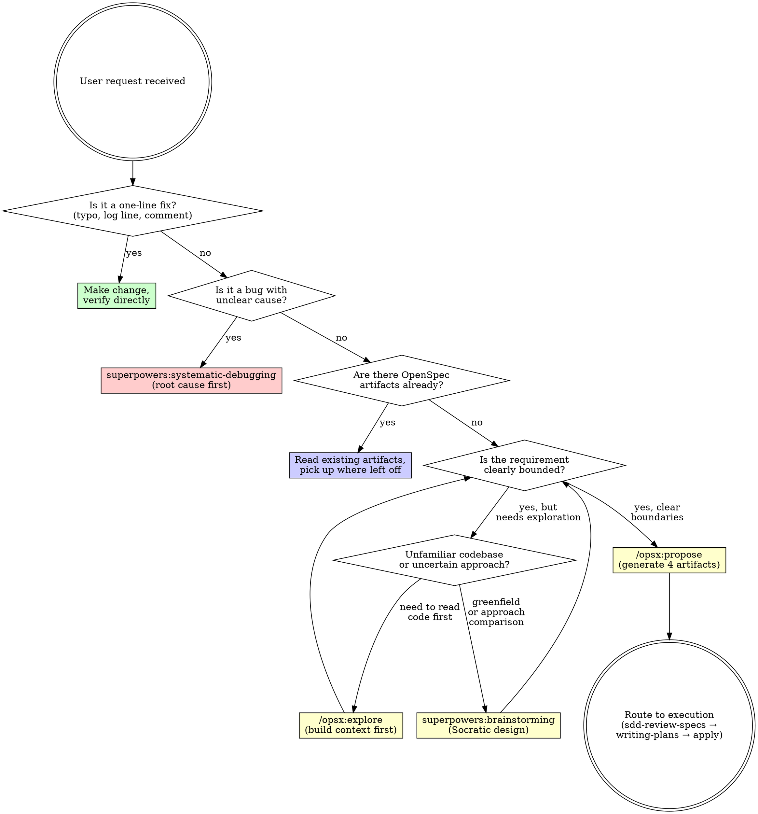

<SUBAGENT-STOP>
If you were dispatched as a subagent to execute a specific task, skip this skill.
</SUBAGENT-STOP>

<EXTREMELY-IMPORTANT>
Spec-driven development means specs live in the file system, not in chat history. OpenSpec manages specification artifacts. Superpowers enforces execution discipline. This skill routes between them.

IF A SPEC EXISTS, YOU MUST READ IT BEFORE WRITING CODE. IF NO SPEC EXISTS FOR BEHAVIOR CHANGE, YOU MUST CREATE ONE FIRST.

This is not negotiable. This is not optional. You cannot rationalize your way out of this.
</EXTREMELY-IMPORTANT>

## Instruction Priority

1. **User's explicit instructions** (CLAUDE.md, AGENTS.md, direct requests) — highest priority
2. **OpenSpec artifacts** (proposal.md, specs/, design.md, tasks.md) — the authoritative spec baseline
3. **SDD workflow skills** — route and enforce process
4. **Default system prompt** — lowest priority

If the user says "skip the spec, just write code," follow the user's instructions. The user is in control.

# SDD Workflow — Spec-Driven Development Router

## Overview

This skill IS the SDD pipeline. Reference it once in CLAUDE.md — you do NOT need to list individual steps. The decision tree, phase detection, and transition rules below handle all routing.

**Announce at start:** "I'm using the sdd-workflow skill to route this development task."

## The Rule

**Before any code, human and AI agree on what to build.** Specifications are files in `openspec/`. Every behavior change is traceable from proposal through archive.

```
NO CODE WITHOUT REVIEWED SPECIFICATIONS FOR BEHAVIOR CHANGES
```

### Request Classification

When the user brings a development request, classify FIRST. Then route.



### Phase Detection

Check the file system to determine where you are in the workflow:

| What exists | Phase | Next action |
|------------|-------|-------------|
| No `openspec/` directory | Uninitialized | Run `openspec init` first |
| `openspec/` exists, no change dir | Ready for proposal | `/opsx:propose <name>` or exploration |
| `openspec/changes/<name>/` with 4 artifacts, unreviewed | Specs need review | Tier 1: self-review inline (2-5 min). Tier 2: `sdd-review-specs` full gate. Default Tier 2 if unsure. |
| `openspec/changes/<name>/` with reviewed artifacts | Ready for execution | `superpowers:writing-plans` → save plan to `openspec/changes/<name>/plan.md` |
| `tasks.md` has unchecked items | In progress | `/opsx:apply` + `superpowers:test-driven-development` |
| All tasks checked, not archived | Ready for delivery | `superpowers:verification-before-completion` → `/opsx:archive` |

## Red Flags

These thoughts mean STOP — you're rationalizing skipping the SDD process:

| Thought | Reality |
|---------|---------|
| "This is simple, I don't need a spec" | Simple changes cause complex bugs. A 5-line proposal.md saves hours. |
| "I'll write the spec after the code" | Specs-after describe what you built, not what's needed. They don't align. |
| "The spec is in the conversation history" | Conversation history evaporates. Files persist. Write it down. |
| "I already know what to build" | Knowing ≠ having it reviewed. Specs are the agreement, not the idea. |
| "Specs slow me down" | Rework from misaligned expectations is slower. Align first, execute second. |
| "This is just a prototype" | Prototypes become production. Spec now saves migration pain later. |
| "I'll just explore the codebase first" | Use `/opsx:explore` — structured exploration with output. Don't browse aimlessly. |
| "I remember how this codebase works" | Code evolves. Your memory is stale. Read the specs. |
| "The tasks.md checklist IS the review" | tasks.md tracks implementation progress. sdd-review-specs validates scope, design, and completeness. These are different activities. |
| "I'll review as I implement" | Review-after-implementation finds what you built, not what you need. The gate must be BEFORE code. |
| "A minimal proposal is good enough" | Partial compliance is non-compliance. The SDD pipeline produces 4 artifacts for a reason. |
| "Can't spec what I don't understand yet" | That's what `/opsx:explore` is for. Build understanding first, then spec. |

**All of these mean: follow the SDD process. No shortcuts.**

## Skill Priority

When multiple tools could apply to a development task, use this order:

1. **Classification first** — Use the decision tree above. Is this a one-line fix? A bug? A behavior change?
2. **Exploration before specification** — `/opsx:explore` to read existing code. `/opsx:propose` to generate artifacts. Never invert.
3. **Review before execution** — `sdd-review-specs` for Tier 2. Self-review for Tier 1. Never skip the gate.
4. **Plan before implementing** — `writing-plans` refines tasks.md into bite-sized steps. Save to `openspec/changes/<name>/plan.md`.
5. **TDD during execution** — `/opsx:apply` + `test-driven-development`. RED → GREEN → REFACTOR per task.
6. **Verify before claiming** — `verification-before-completion` with fresh evidence. Then `/opsx:archive`.

## Skill Types

Not every tool in the SDD pipeline has the same strictness. Know which type you're in:

**Rigid** — Follow exactly. Don't adapt away the sequence:
- `sdd-review-specs` — The gate function is non-negotiable for Tier 2
- `/opsx:propose`, `/opsx:apply`, `/opsx:archive` — CLI tools with defined behavior
- `@test-driven-development` — RED → GREEN → REFACTOR, no shortcuts
- `@systematic-debugging` — Root cause before fixes
- `@verification-before-completion` — Fresh evidence required
- **`sdd-workflow`** (this skill) — Follow the routing exactly

**Flexible** — Adapt principles to context:
- `@brainstorming` — Socratic design, adapt depth to complexity
- `@writing-plans` — Task granularity scales with feature complexity
- `/opsx:explore` — Depth of exploration matches uncertainty level

## Tool Selection Matrix

When both OpenSpec and Superpowers offer a tool for the same phase, use this:

| Scenario | Use This | Not That | Why |
|----------|----------|----------|-----|
| Reading existing code, finding patterns | `/opsx:explore` | `@brainstorming` | Explore reads code; brainstorming generates ideas |
| Defining new feature from scratch | `@brainstorming` | `/opsx:explore` | Brainstorming compares approaches; explore describes existing state |
| Generating spec artifacts | `/opsx:propose` | `@writing-plans` | Propose creates the 4-artifact structure; writing-plans refines granularity |
| Refining task granularity | `@writing-plans` | Manual only | Writing-plans converts coarse tasks to 2-5min bite-sized units |
| Executing tasks | `/opsx:apply` + `@test-driven-development` | Either alone | Apply is the scheduler; TDD is the executor. Pipeline them. |
| Debugging failures | `@systematic-debugging` | Direct fixes | Root cause investigation first. Never trial-and-error. |
| Code review | `@requesting-code-review` + `@receiving-code-review` | "Looks good to me" | Structured review with independent context |
| Claiming completion | `@verification-before-completion` | "Should work now" | Fresh verification evidence required |
| Archiving completed work | `/opsx:archive` | Manual file moves | Archive does delta merge + timestamp + project.md update |

## The SDD Pipeline

For behavior changes, follow this linear pipeline. Each step produces a file or observable artifact.

```
1. [User request]
     ↓
2. /opsx:new <name>            — Create change skeleton. Agree on scope before proceeding.
     ↓
3. /opsx:continue <name>       — Iterate: proposal.md → specs/ → design.md → tasks.md.
     ↓                            Review each artifact with the user before continuing.
4. sdd-review-specs            — Validate the 4 artifacts. Tier-based gate.
     ↓                            Produces review.md.
5. superpowers:writing-plans   — Refine tasks.md into bite-sized 2-5 min steps.
     ↓                            Produces openspec/changes/<name>/plan.md.
6. /opsx:apply +               — TDD execution: RED → GREEN → REFACTOR cycle.
   @test-driven-development      Each task checked off as completed.
     ↓
7. @requesting-code-review     — Structured code review after implementation.
     ↓                            Fix Critical issues immediately.
8. @verification-before-       — Fresh test run. Evidence before completion claim.
   completion
     ↓
9. /opsx:archive               — Delta merge into openspec/specs/, change archived.
     ↓
10. [Delivered]
```

## Transition Rules

After each step completes, route to the next:

```
Step 2: /opsx:new <name>           → present scope to user, confirm before Step 3
Step 3: /opsx:continue <name>      → iterate until all 4 artifacts complete
                                      (use /opsx:ff to fast-forward remaining artifacts
                                      once direction is confirmed)
Step 4: sdd-review-specs           → DETERMINE TIER, then route:
  Tier 0 (typo/log/comment)         → skip pipeline entirely — verify directly
  Tier 1 (single field, config)     → self-review inline: check proposal scope boundary
                                      and tasks executability. Skim design for conflicts.
                                      2-5 min. Then proceed to Step 5.
  Tier 2 (new feature, refactor)    → HARD STOP. Full gate function. Produce review.md.
                                      Do NOT proceed until it passes.
  When in doubt, default to Tier 2.
Step 5: writing-plans              → save output to openspec/changes/<name>/plan.md
Step 6: apply + tdd                → on error: superpowers:systematic-debugging → return to apply
                                      on all tasks done: proceed to Step 7
Step 7: @requesting-code-review    → dispatch superpowers:code-reviewer
                                      fix Critical/Important issues before Step 8
Step 8: @verification-before-      → fresh go test ./... / pytest / etc.
  completion
Step 9: /opsx:archive              → merge specs, move to archive, commit, push
Step 10: done
```

## Related Skills

- **sdd-review-specs** — Structured review of OpenSpec 4 artifacts before implementation
- **superpowers:brainstorming** — Socratic design for greenfield features
- **superpowers:writing-plans** — Convert coarse tasks to 2-5min bite-sized units
- **superpowers:test-driven-development** — RED-GREEN-REFACTOR cycle
- **superpowers:systematic-debugging** — Root cause investigation before fixes
- **superpowers:verification-before-completion** — Evidence before completion claims
- **superpowers:requesting-code-review** — Structured code review
- **superpowers:finishing-a-development-branch** — Merge/PR/keep/discard decisions

OpenSpec command reference: `/opsx:explore`, `/opsx:propose`, `/opsx:apply`, `/opsx:verify`, `/opsx:archive`

## User Instructions

Instructions say WHAT, not HOW. "Add X" or "Fix Y" doesn't mean skip workflows. The SDD process is the HOW — it exists to ensure alignment before code, not to slow you down.

If you want to bypass a step (skip review, write code directly, skip the spec), say so explicitly. The user is in control. The skill routes, the user decides.

## The Bottom Line

**Specs before code. Review before execution. Evidence before completion.**

The SDD process exists because AI programming without a spec layer drifts. Each phase produces a file in `openspec/` — that file is the agreement. Honor it.