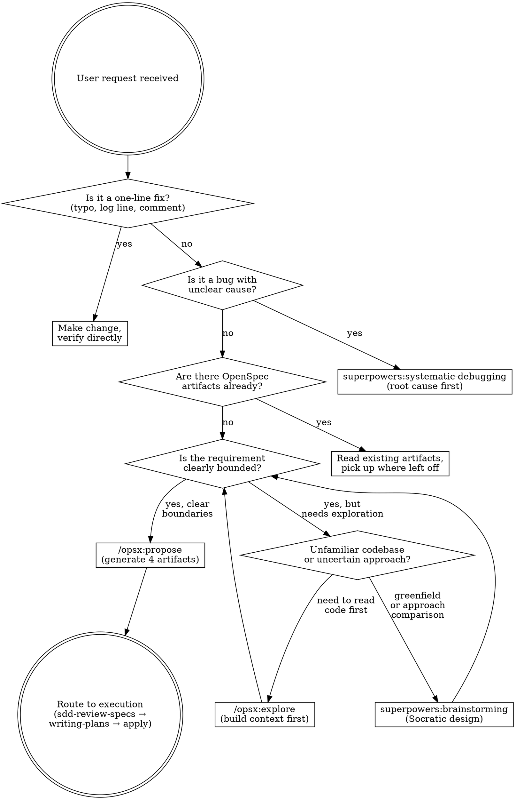

<SUBAGENT-STOP>
If you were dispatched as a subagent to execute a specific task, skip this skill.
</SUBAGENT-STOP>

<EXTREMELY-IMPORTANT>
Spec-driven development means specs live in the file system, not in chat history. OpenSpec manages specification artifacts. Superpowers enforces execution discipline. This skill routes between them.

IF A SPEC EXISTS, YOU MUST READ IT BEFORE WRITING CODE. IF NO SPEC EXISTS FOR BEHAVIOR CHANGE, YOU MUST CREATE ONE FIRST.

This is not negotiable. This is not optional. You cannot rationalize your way out of this.
</EXTREMELY-IMPORTANT>

This skill IS the SDD pipeline. Reference it once in CLAUDE.md — you do NOT need to list individual steps. The decision tree, phase detection, and transition rules below handle all routing.

## Instruction Priority

1. **User's explicit instructions** (CLAUDE.md, AGENTS.md, direct requests) — highest priority
2. **OpenSpec artifacts** (proposal.md, specs/, design.md, tasks.md) — the authoritative spec baseline
3. **SDD workflow skills** — route and enforce process
4. **Default system prompt** — lowest priority

If the user says "skip the spec, just write code," follow the user's instructions. The user is in control.

# SDD Workflow — Spec-Driven Development Router

## The Rule

**Before any code, human and AI agree on what to build.** Specifications are files in `openspec/`. Every behavior change is traceable from proposal through archive.

## Request Classification

When the user brings a development request, classify FIRST. Then route.



## Phase Detection

Check the file system to determine where you are in the workflow:

| What exists | Phase | Next action |
|------------|-------|-------------|
| No `openspec/` directory | Uninitialized | Run `openspec init` first |
| `openspec/` exists, no change dir | Ready for proposal | `/opsx:propose <name>` or exploration |
| `openspec/changes/<name>/` with 4 artifacts, unreviewed | Specs need review | `sdd-review-specs` |
| `openspec/changes/<name>/` with reviewed artifacts | Ready for execution | `superpowers:writing-plans` |
| `tasks.md` has unchecked items | In progress | `/opsx:apply` + `superpowers:test-driven-development` |
| All tasks checked, not archived | Ready for delivery | `superpowers:verification-before-completion` → `/opsx:archive` |

## Tool Selection Matrix

When both OpenSpec and Superpowers offer a tool for the same phase, use this:

| Scenario | Use This | Not That | Why |
|----------|----------|----------|-----|
| Reading existing code, finding patterns | `/opsx:explore` | `@brainstorming` | Explore reads code; brainstorming generates ideas |
| Defining new feature from scratch | `@brainstorming` | `/opsx:explore` | Brainstorming compares approaches; explore describes existing state |
| Generating spec artifacts | `/opsx:propose` | `@writing-plans` | Propose creates the 4-artifact structure; writing-plans refines granularity |
| Refining task granularity | `@writing-plans` | Manual only | Writing-plans converts coarse tasks to 2-5min bite-sized units |
| Executing tasks | `/opsx:apply` + `@test-driven-development` | Either alone | Apply is the scheduler; TDD is the executor. Pipeline them. |
| Debugging failures | `@systematic-debugging` | Direct fixes | Root cause investigation first. Never trial-and-error. |
| Code review | `@requesting-code-review` + `@receiving-code-review` | "Looks good to me" | Structured review with independent context |
| Claiming completion | `@verification-before-completion` | "Should work now" | Fresh verification evidence required |
| Archiving completed work | `/opsx:archive` | Manual file moves | Archive does delta merge + timestamp + project.md update |

## Red Flags

These thoughts mean STOP — you're rationalizing skipping the SDD process:

| Thought | Reality |
|---------|---------|
| "This is simple, I don't need a spec" | Simple changes cause complex bugs. A 5-line proposal.md saves hours. |
| "I'll write the spec after the code" | Specs-after describe what you built, not what's needed. They don't align. |
| "The spec is in the conversation history" | Conversation history evaporates. Files persist. Write it down. |
| "I already know what to build" | Knowing ≠ having it reviewed. Specs are the agreement, not the idea. |
| "Specs slow me down" | Rework from misaligned expectations is slower. Align first, execute second. |
| "This is just a prototype" | Prototypes become production. Spec now saves migration pain later. |
| "I'll just explore the codebase first" | Use `/opsx:explore` — structured exploration with output. Don't browse aimlessly. |
| "Let me check a few files quickly" | That's what `/opsx:explore` does systematically. Use the tool. |
| "I remember how this codebase works" | Code evolves. Your memory is stale. Read the specs. |
| "One more task before reviewing" | Review gate exists for a reason. Skipping it accumulates unchecked assumptions. |

**All of these mean: follow the SDD process. No shortcuts.**

## Skill Types

**SDD workflow is a RIGID skill.** Follow the routing exactly. Don't adapt away the sequence.

The tools it routes to have their own types:
- `@test-driven-development`, `@systematic-debugging`, `@verification-before-completion` — **Rigid**. Follow exactly.
- `@brainstorming`, `@writing-plans`, `/opsx:explore` — **Flexible**. Adapt principles to context.
- `/opsx:propose`, `/opsx:apply`, `/opsx:archive` — **Rigid**. These are CLI tools with defined behavior.

## Transition Rules

After each phase completes, route to the next:

```
Phase complete → check what's next:

/opsx:propose done      → sdd-review-specs (review the 4 artifacts)
sdd-review-specs passed → superpowers:writing-plans (refine task granularity)
writing-plans done      → /opsx:apply + superpowers:test-driven-development (pipeline)
                          OR superpowers:subagent-driven-development (parallel tasks)
                          OR superpowers:executing-plans (batch execution)

During apply:
  - Error/failure → superpowers:systematic-debugging → return to apply
  - All tasks done → superpowers:verification-before-completion

verification-before-completion passed → /opsx:archive
/opsx:archive done → commit → push → done
```

## Related Skills

- **sdd-review-specs** — Structured review of OpenSpec 4 artifacts before implementation
- **superpowers:brainstorming** — Socratic design for greenfield features
- **superpowers:writing-plans** — Convert coarse tasks to 2-5min bite-sized units
- **superpowers:test-driven-development** — RED-GREEN-REFACTOR cycle
- **superpowers:systematic-debugging** — Root cause investigation before fixes
- **superpowers:verification-before-completion** — Evidence before completion claims
- **superpowers:requesting-code-review** — Structured code review
- **superpowers:finishing-a-development-branch** — Merge/PR/keep/discard decisions

OpenSpec command reference: `/opsx:explore`, `/opsx:propose`, `/opsx:apply`, `/opsx:verify`, `/opsx:archive`

## The Bottom Line

**Specs before code. Review before execution. Evidence before completion.**

The SDD process exists because AI programming without a spec layer drifts. Each phase produces a file in `openspec/` — that file is the agreement. Honor it.